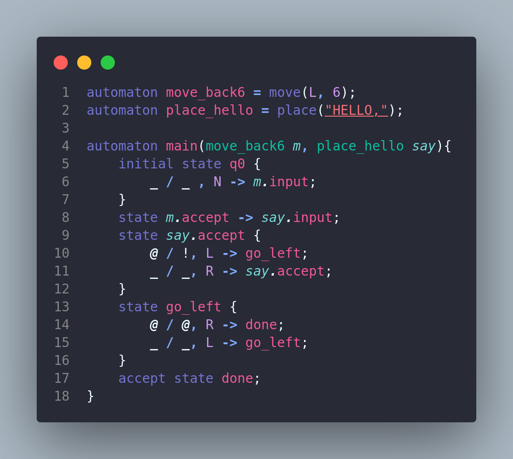

# Amethyst

**Amethyst** is a **programming language** where you write everything using **Turing machines**. Its goal is to help grow the understanding of this popular and powerful **computational model**.

### Installation

If you have `cargo`, you can install the binary directly from crates.io

```
cargo install amethyst_geode
```

There are also precompiled binaries available for [Windows, macOS, and Linux](https://github.com/VSebastian8/amethyst/releases).

### Running a .myst file

```bash
geode run code/add.myst -input 110+01 -o -limit 500 -tape
```

Or you can specify the compilation flags in a separate file:

```bash
geode r code/simple.myst -c config/example.txt -start verify
```

### Run configuration flags

|         Flag         | Shorthand  |       Argument       | Default |
| :------------------: | :--------: | :------------------: | :-----: |
|        -input        |     -i     | initial tape content |    @    |
|       -output        |     -o     |                      |  false  |
|        -tape         |     -t     |                      |  false  |
|        -bound        |     -b     | max number of cells  |  none   |
| -iterations / -limit | -iter / -l | max number of steps  |  1200   |
|        -debug        |     -d     |                      |  false  |
|       -config        |     -c     |  path/to/config.txt  |         |

### Wildcard symbol

As a quality of life feature, amethyst supports the **wildcard pattern** `_` in transitions. For a state, when a transition has a wildcard as the read symbol, all tape symbols that do not have an already matching transition will **match** the wildcard and the cell will be rewriten with the write symbol. When both the reading and writing symbols are wildcards, the cell will not be rewriten for all tape symbol that match. This functionality heavily helps with **code readability** and \*\*avoiding repetition\*\*.

### Arrow states

Arrow states are states that do nothing but move to another state. The following notation: `state1 -> state2;` is **syntactic sugar** for `state1 { _ / _, N -> state2}`. This pattern appeared often when working with components, especially in the case of multiple macros where one final state simply lead into the next input state.

### Components

**Components** are a way to **reuse code**. Syntactically, they look like function arguments for the automata, but they are _static copies_ of the specified turing machines.

_E.g. Let's say we have written a turing machine that adds two numbers together and we would like to reuse this code. We can add this 'add' automaton as a component to the 'main' automaton like so `automaton main(add a){...}`. We can consider the 'a' component of a static turing machine with the blueprint of 'add'. We use 'a' as a black box, concerning ourselves only with its input `a.initial_state` and output `a.accept_states` & `a.reject_states`_.

Each component's initial state is exposed to the parent turing machine. Final states (accepting and rejecting) of the component automata have to be rewriten in order to continue the execution of the parent machine.

### Macros

**Macros** are a way to **reduce boilerplate code**, whether that be a very common and useful machine or a machine with many repetitive states.

_E.g. To move exactly 8 cells to the right we would need 8 states with each state having the only job of making a right move and going to the next state_.

These are **not functions with variables**, they are just **syntactic sugar** that gets expanded into a specific turing machine at compile time. Each macro-machine will have one initial state (input) and two final states (accept and reject). Some macros (such as move or shift) do not use the reject state since there's no way they can fail.

The following macros are present so far:

- `complement` (automaton)
  - accepts only if the automaton rejects and vice versa
- `intersect` (automaton, automaton)
  - takes two or more automata and accepts the input only if all of the automata accept said input
- `reunion` (automaton, automaton, automaton)
  - takes two or more automata and accepts the input only if any of the automata accept said input
  - the three macros above are not useful in terms of output, but can be used for recognizing formal languages
- `chain` (automaton, automaton, automaton)
  - takes two or more automata and chains them like so:
    - macro input state -> first automaton's initial state
    - nth automaton's accept state -> (n+1)th automaton's initial state
    - last automaton's accept state -> macro accept state
    - all automata reject states -> macro reject state
- `repeat` (automaton, number)
  - equivalent with a chain of n automata of the same type
- `move` (moveSymbol, number)
  - moves the head left or right a number of positions
- `override` (moveSymbol, number, tapeSymbol)
  - a move that also replaces the tape symbols it encounters with the given symbol
- `place` (string)
  - override to the right with a string of tape symbols, useful for writing simple output
- `shift` (moveSymbol, number)
  - a right shift inserts a number of cells to the right of the current position (all of the cells to the right of the head shift right)
  - a left shift deletes a number of cells to the left of the current position (all of the cells to the right of the head shift left)

### Example



<!-- for when amethyst syntax highlighting is supported
```amethyst
automaton move_back6 = move(L, 6);
automaton place_hello = place("HELLO,");
automaton main(move_back6 m, place_hello say){
    initial state q0 {
        _ / _ , N -> m.input;
    }
    state m.accept -> say.input;
    state say.accept {
        @ / !, L -> go_left;
        _ / _, R -> say.accept;
    }
    state go_left {
        @ / @, R -> done;
        _ / _, L -> go_left;
    }
    accept state done;
}
``` -->

```bash
geode run code/hello.myst -input WORLD -debug -output -tape
```

You can find more code examples [here](https://github.com/VSebastian8/amethyst/tree/master/code)
