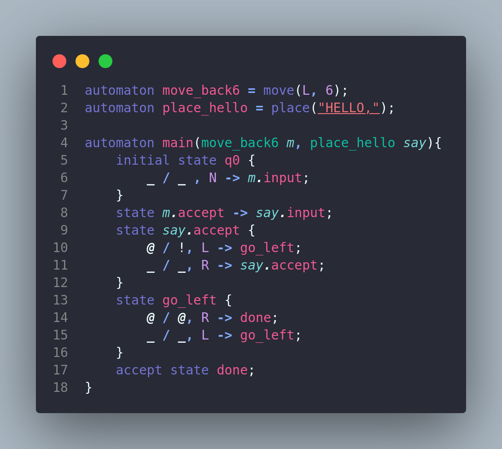

# Amethyst

**Amethyst** is a **programming language** where you write everything using **Turing machines**. Its goal is to help grow the understanding of this popular and powerful **computational model**.

### Installation

If you have `cargo`, you can install the binary directly from crates.io

```
cargo install amethyst_geode
```

There are also precompiled binaries available for [Windows, macOS, and Linux](https://github.com/VSebastian8/amethyst/releases).

### Running a .myst file

You can use the interpreter to directly simulate the Turing Machine:

```bash
geode run code/abc.myst --tape AABBCC --start validator
```

Or you first compile it to a Linux binary and then run it on an input:

```bash
geode compile code/abc.myst
./validator AABBCC
```

### Wildcard symbol

As a quality of life feature, amethyst supports the **wildcard pattern** `_` in transitions. For a state, when a transition has a wildcard as the read symbol, all tape symbols that do not have an already matching transition will **match** the wildcard and the cell will be rewriten with the write symbol. When both the reading and writing symbols are wildcards, the cell will not be rewriten for all tape symbol that match. This functionality heavily helps with **code readability** and **avoiding repetition**.

### Arrow states

Arrow states are states that do nothing but move to another state. The following notation: `state1 -> state2;` is **syntactic sugar** for `state1 { _ / _, N -> state2}`. This pattern appeared often when working with components, especially in the case of multiple macros where one final state simply lead into the next input state.

### Components

**Components** are a way to **reuse code**. Syntactically, they look like function arguments for the automata, but they are _static copies_ of the specified turing machines.

_E.g. Let's say we have written a turing machine that adds two numbers together and we would like to reuse this code. We can add this 'add' automaton as a component to the 'main' automaton like so `automaton main(add a){...}`. We can consider the 'a' component of a static turing machine with the blueprint of 'add'. We use 'a' as a black box, concerning ourselves only with its input `a.initial_state` and output `a.accept_states` & `a.reject_states`_.

Each component's initial state is exposed to the parent turing machine. Final states (accepting and rejecting) of the component automata have to be rewriten in order to continue the execution of the parent machine.

### VS Code Extensions

- LSP
- Syntax Highlighting
- Themes (Sun & Moon)

Find them in the VS Code MarketPlace or as packaged vsix files [here](https://github.com/VSebastian8/amethyst/releases).

### Examples

<!--
 -->

<!-- for when amethyst syntax highlighting is supported
```amethyst
automaton move_back6 = move(L, 6);
automaton place_hello = place("HELLO,");
automaton main(move_back6 m, place_hello say){
    initial state q0 {
        _ / _ , N -> m.input;
    }
    state m.accept -> say.input;
    state say.accept {
        @ / !, L -> go_left;
        _ / _, R -> say.accept;
    }
    state go_left {
        @ / @, R -> done;
        _ / _, L -> go_left;
    }
    accept state done;
}
``` -->

<!-- ```bash
geode run code/hello.myst -input WORLD -debug -output -tape
``` -->

You can find code examples [here](https://github.com/VSebastian8/amethyst/tree/master/code)
