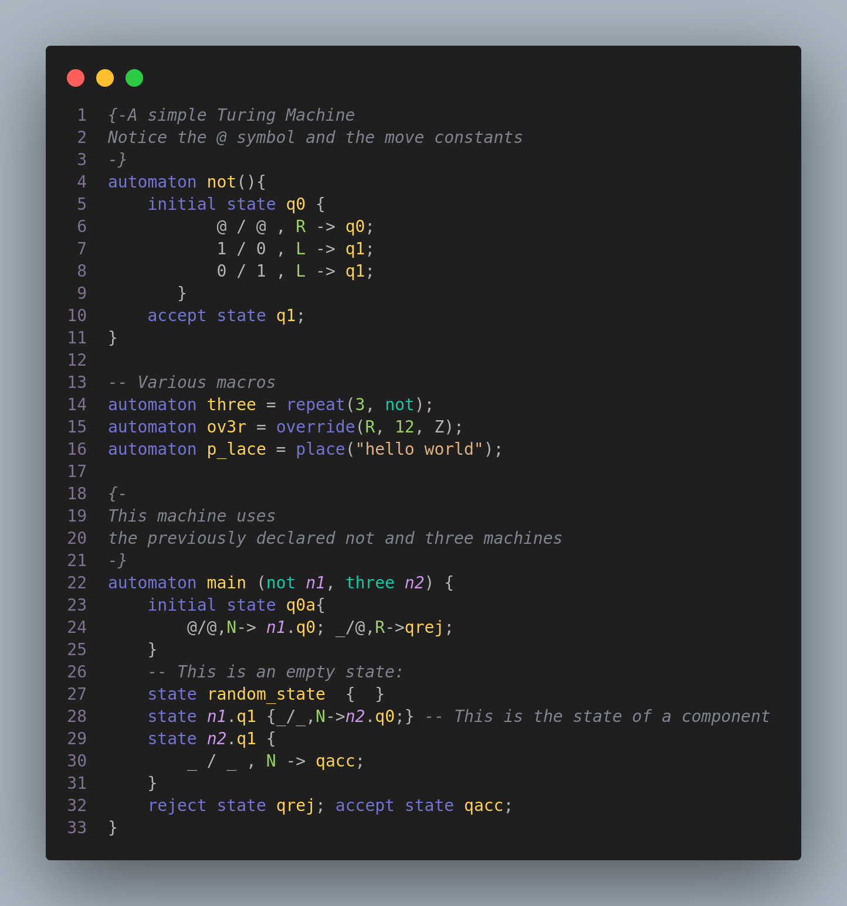

# Amethyst Syntax Highlighting

This extension provides _syntax highlighting_ for **Amethyst**, the _Turing Machine Programming Language_.

File association: `.myst`

## Features

- **Symbols**: blank(`@`), wildcard(`_`), characters and upper letters, other(`-+=/()`...)
- **Operators**: write(`/`), move(`,`), arrow(`->`)
- **Constants**: numeric(`0-9`), move(`LRN`)
- **Declarations**: automata, state
- **Control**: initial, accept, reject
- **Macros**: complement, intersect, reunion,chain, repeat, move, override, place, shift
- **Comments**: line(`--`), block(`{--}`)

## Example

